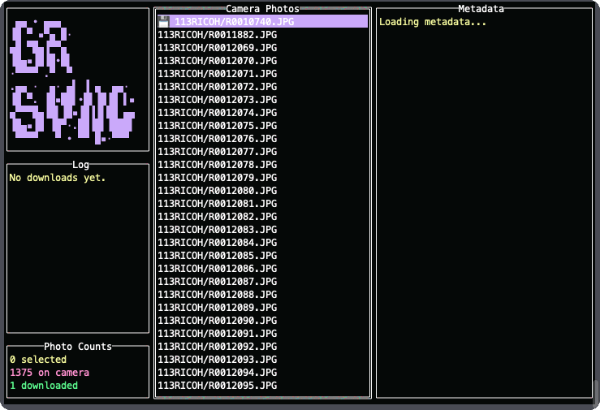

# grsync-tui

A fast terminal user-interface for transferring photos from **Ricoh GR** cameras to your computer via WiFi or USB.



## Features

- Browse and select photos from your camera to download
- Supports both WiFi and USB connections
- Preview photos in terminal
- Cross-platform (macOS, Linux, Windows, Termux, etc.)
- Won't download photos that already exist in the download directory

## Installation

Install with Go:

```bash
go install github.com/tonytwostep/grsync-tui@latest
```

Or build manually:

```bash
git clone https://github.com/TonyTwoStep/grsync-tui.git
cd grsync-tui
go build -o grsync-tui
./grsync-tui
```

## Configuration

On first run, a config file is automatically created at `~/.config/grsync-tui.json` with some safe defaults.

You can edit this file to set:

- `connection_method`: `"usb"` or `"wifi"`
- `download_dir`: Directory where downloaded photos are saved
- `usb.camera_dir`: Path to the mounted camera directory (for USB mode)

## Usage

Run `grsync-tui` in your terminal.

### Controls / Hotkeys

Use `? / h` to view the applications help menu.
Here is the list as a Markdown table:

| Key            | Action                                |
| -------------- | ------------------------------------- |
| Up / k         | Move up one item                      |
| Down / j       | Move down one item                    |
| Shift+Up / K   | Expand selection up                   |
| Shift+Down / J | Expand selection down                 |
| Space          | Toggle selection of current item      |
| Ctrl+A         | Select all items                      |
| Ctrl+D         | Deselect all items                    |
| d              | Download selected photos              |
| p              | Show image preview (ascii)            |
| PgUp / PgDn    | Scroll log up or down                 |
| Home / End     | Scroll photo list to beginning or end |
| h / ?          | Show this help                        |
| Ctrl+Q         | Quit the application                  |

## Requirements

- Go 1.24.3
- For WiFi: The device must be connected to the camera's network
- For USB: Camera must be mounted
